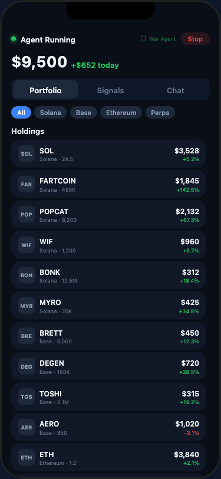

# CoinDCX Permissioned Trading Agent

A mobile-first, embeddable AI trading agent platform with on-chain screening, multi-chain execution, and risk-managed exit strategies.



## Architecture

```
coindcx-trading-agent/
├── src/                    # Backend agent core (TypeScript)
│   ├── adapters/           # Host app adapters (CoinDCX, generic)
│   ├── api/                # Fastify REST + WebSocket API
│   ├── audit/              # Trade audit trail & compliance logging
│   ├── core/               # Agent lifecycle, event bus, config
│   ├── data/               # Market data ingestion (price feeds, orderbooks)
│   ├── permissions/        # User permission model (scoped API keys)
│   ├── risk/               # Risk engine (position limits, circuit breakers)
│   ├── strategy/           # Strategy engine (meme sniper, DCA, momentum)
│   ├── trader/             # Order execution (Jupiter, Uniswap, Hyperliquid)
│   ├── wallet/             # KMS-backed wallet management
│   └── index.ts            # Entry point
├── dashboard/              # Mobile-first React dashboard (Vite + React 19)
│   └── src/app/
│       ├── components/     # ChatBubble, MobileCard, TradeEventCard, etc.
│       ├── context/        # AppContext (agent status, portfolio state)
│       ├── layouts/        # PhoneFrame (desktop simulator), MobileLayout
│       ├── screens/        # MainScreen (unified 3-tab UI)
│       ├── services/       # blockchain.ts (screening), chatEngine.ts (NLP)
│       └── styles/         # Mobile design tokens
├── control-plane/          # Admin control plane
├── sdk/                    # Client SDKs (API spec, React Native)
├── cli/                    # CLI commands
├── k8s/                    # Kubernetes manifests
├── docker-compose.yml      # Local dev environment
└── Dockerfile              # Production image
```

## Features

### AI Trading Agent (Chat Interface)
- **Natural language trading** — "buy FARTCOIN $200", "screen POPCAT", "long TSLA 3x", "screen MON"
- **16+ intent types** — buy, sell, screen, analyze, snipe, DCA, copy, trending, positions, P&L
- **Contract address screening** — paste any EVM (0x...), Solana (base58), Sui/Aptos (0x + 64 hex), or Move module path to auto-screen
- **Token name resolution** — 40+ known contracts auto-resolve across all supported chains

### On-Chain Screening (War Agent)
- **6-factor scoring** — Age, Volume, Liquidity, Holder concentration, LP Lock, RugCheck score
- **5 intelligence sources** — Photon (bundles/LP), Axiom (smart money), FOMO (social), RugCheck (audit), DexScreener (liquidity)
- **AI Confidence & Rug Probability** — composite scores from multi-source data
- **Grade system** — A through F with actionable recommendations

### Multi-Chain Execution (21 Chains)
| Chain | DEX | Assets |
|-------|-----|--------|
| Solana | Jupiter v6 | Memecoins (FARTCOIN, POPCAT, WIF, BONK, MYRO) |
| Base | Aerodrome | Base tokens (DEGEN, BRETT, TOSHI, AERO) |
| Ethereum | Uniswap V3 | ETH, PEPE, MOG, blue chips |
| Arbitrum | Camelot / GMX | ARB, GMX, PENDLE, DeFi |
| Polygon | QuickSwap | POL, AAVE, QI |
| BSC | PancakeSwap | BNB, CAKE |
| Optimism | Velodrome | OP, VELO |
| Avalanche | Trader Joe | AVAX, JOE |
| Monad | Kuru DEX | MON, KURU, MOYAKI |
| Sui | Cetus | SUI, CETUS, TURBOS, NAVX |
| Aptos | Liquidswap | APT, THALA, GUI |
| Perps | Hyperliquid | US stocks (TSLA, NVDA, AAPL, AMZN) |

*Also supports: Blast, zkSync, Fantom, Linea, Scroll, Mantle, Celo, Gnosis*

### Risk Management (Auto Exit Strategies)
- **Meme coins**: Micro SL (-25%/30s) + Ladder exit (sell 40% at 2.5x) + Trailing (-30%)
- **Blue chips**: SL (-5%) + TP (+20%) + Trailing (-8%)
- **Perps**: SL (-8%) + TP (+15%) + Trailing (-6%)

### US Stock Perps (Hyperliquid)
- **Dedicated perps section** — separated from crypto holdings with LONG/SHRT badges
- **Leverage display** — 2x/3x leverage with entry price and P&L per position
- **Supported stocks** — TSLA, NVDA, AAPL, AMZN with auto exit strategies

### Mobile UI
- **3-tab unified layout** — Portfolio | Signals | Chat
- **12 chain filters** — scrollable chain pills (Solana, Base, Ethereum, Arbitrum, Polygon, BSC, Optimism, Avalanche, Monad, Sui, Aptos)
- **Phone frame simulator** — 375x812 desktop preview with notch
- **Paste & copy** — clipboard paste button for addresses, copy buttons on results
- **Buy buttons** — one-tap $50/$200/$500 buy after screening
- **Color-coded responses** — green (safe), yellow (warn), red (danger) for all data

## Getting Started

### Prerequisites
- Node.js 18+
- npm or pnpm

### Quick Start (Dashboard Only)

```bash
# Clone
git clone https://github.com/kushagra93/coindcx-trading-agent.git
cd coindcx-trading-agent

# Install dependencies
npm install
cd dashboard && npm install && cd ..

# Run the dashboard
npm run dashboard
# Open http://localhost:5174/app/home
```

The dashboard runs in **paper trading mode** with simulated data — no API keys needed.

### Full Backend Setup

```bash
# Copy environment config
cp .env.example .env
# Edit .env with your API keys (Helius, Alchemy, Anthropic, etc.)

# Start infrastructure
docker-compose up -d   # PostgreSQL + Redis

# Run backend
npm run dev

# Run dashboard (separate terminal)
npm run dashboard
```

### Environment Variables

See `.env.example` for all configuration options. Key ones:

| Variable | Required | Description |
|----------|----------|-------------|
| `DRY_RUN` | No | `true` for paper trading (default) |
| `SOLANA_RPC_URL` | For live | Helius/QuickNode Solana RPC |
| `EVM_RPC_URL` | For live | Alchemy/Infura EVM RPC |
| `ANTHROPIC_API_KEY` | For AI | Claude API for advanced analysis |
| `DATABASE_URL` | For backend | PostgreSQL connection string |
| `REDIS_URL` | For backend | Redis for caching & pub/sub |

## Development

### Project Scripts

```bash
# Backend
npm run dev          # Start backend with hot reload
npm run build        # Compile TypeScript
npm run test         # Run tests (vitest)
npm run typecheck    # Type check without emit
npm run lint         # ESLint

# Dashboard
npm run dashboard    # Start Vite dev server on :5174
cd dashboard && npm run build   # Production build
```

### Dashboard Architecture

The dashboard is a standalone React 19 + Vite app under `dashboard/`. Key files:

| File | Purpose |
|------|---------|
| `services/blockchain.ts` | Token DB, screening logic, position management, contract address lookup |
| `services/chatEngine.ts` | NLP intent detection, response generators, conversation context |
| `components/ChatBubble.tsx` | Color-coded chat messages, buy buttons, copy/paste for addresses |
| `screens/MainScreen.tsx` | Unified 3-tab screen (Portfolio, Signals, Chat) |
| `context/AppContext.tsx` | Global state (agent status, portfolio, onboarding) |
| `layouts/PhoneFrame.tsx` | Desktop phone simulator (375x812 with notch) |

### Adding a New Token

1. Add to `TOKEN_DB` in `blockchain.ts` with full `TokenMetrics`
2. Add contract address to `CONTRACT_DB` for address-based lookup
3. Add symbol to `ALL_TOKENS` regex in `chatEngine.ts`
4. If meme coin, add to `MEME_TOKENS` set; if perp, add to `PERP_TOKENS`

### Adding a New Chat Command

1. Add intent type to the `Intent` union in `chatEngine.ts`
2. Add detection pattern in `detectIntent()`
3. Create handler function `handle<Intent>()`
4. Add case to the switch in `processMessage()`

## Tech Stack

- **Backend**: TypeScript, Fastify, Drizzle ORM, PostgreSQL, Redis, Pino
- **Dashboard**: React 19, Vite, TypeScript, Recharts, Lucide Icons
- **Blockchain**: @solana/web3.js, ethers.js, Jupiter v6 API, Hyperliquid SDK, Sui/Aptos Move VM
- **Security**: AWS KMS for key management, scoped permissions, audit logging
- **Infra**: Docker, Kubernetes, docker-compose for local dev

## Contributing

1. Fork the repo
2. Create a feature branch: `git checkout -b feature/my-feature`
3. Make changes and ensure `npm run typecheck` passes
4. Test the dashboard: `npm run dashboard` and verify at `http://localhost:5174/app/home`
5. Commit with descriptive messages
6. Push and open a PR

### Code Style
- Inline CSS-in-JS (no CSS modules or Tailwind) — matches existing pattern
- No new dependencies unless necessary
- TypeScript strict mode — zero `any` types
- Functional components with hooks

## License

MIT
